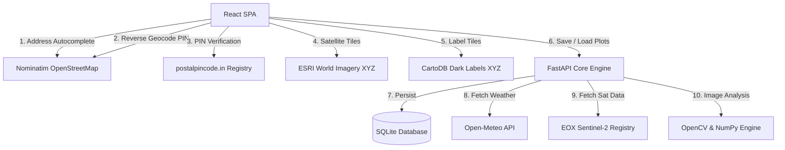

# 🌾 UrbanHarvest — Cybernetic Geospatial Roof Analytics

**UrbanHarvest** is an open-source geospatial sustainability planning application that lets urban developers, property owners, and environmental enthusiasts evaluate the viability of rooftop real estate for green energy (photovoltaics) and urban agriculture using computer vision and open mapping data.

Built for the national-level hackathon **Unbound '26** under the theme of **Open Innovation**. This project relies entirely on open-source packages and open APIs — no paid or closed-source dependencies.

---

## 🚀 Key Features

### 🗺️ Location Discovery
- **Address Geocoding**: Real-time address autocomplete via OpenStreetMap Nominatim with instant prediction dropdown.
- **Postal PIN Code Verification**: Indian PIN code lookup against the Open Government Data postal registry (`api.postalpincode.in`), with coordinate resolution.
- **Automatic PIN Resolution**: When an address search returns no postcode, the app reverse-geocodes the selected coordinates via Nominatim `/reverse` to determine the correct local PIN code — no hardcoded fallbacks.

### 🛰️ Open-Source Satellite Map
- **Base Layer**: [ESRI World Imagery](https://server.arcgisonline.com/ArcGIS/rest/services/World_Imagery/MapServer) — high-resolution, freely accessible satellite tiles.
- **Label Overlay**: [CartoDB Dark Labels](https://carto.com/basemaps/) — open-source labels-only transparent overlay with road names, place labels, and POIs layered on top of the satellite imagery.
- Both layers served as XYZ tiles via OpenLayers with no API key required.

### ✏️ Rooftop Boundary Tracing
- **Lasso Drawing Tool**: Click-to-draw polygon on the live satellite map to trace exact rooftop perimeters.
- **Area Calculation**: Uses OpenLayers `getArea()` (spherical geodesic calculation) to compute precise footprint in m².
- **Persistent Polygon**: Drawn boundary remains visible on the map after selection — does not disappear.
- **Reselect**: One-click to clear and redraw the polygon.

### ⚡ Monthly Power Consumption Input
- A dedicated input field in the map sidebar (appears after drawing a boundary) lets users enter their **monthly electricity consumption in kWh**.
- This value is stored in global state and flows directly into the feasibility report to compute bill savings, payback period, and energy coverage percentage.

### 📊 Mode-Based Feasibility Reports
All three analysis modes use the same unified `LocationReport` dashboard with conditional cards:

| Mode | Cards Shown |
|---|---|
| **Solar Only** | Rooftop Solar Potential + INSIGHTS (solar) |
| **Crops Only** | Rooftop Farming Potential + INSIGHTS (crops) |
| **Hybrid Agrivoltaics** | Solar + Farming + INSIGHTS (hybrid) |

#### Solar Potential Card
- Estimated system size (kWp)
- Annual energy output (MWh)
- Annual CO₂ saved (tons/year)
- Solar suitability score (%)

#### Farming Potential Card
- Cultivation area (m²)
- Estimated crop yield (kg/year)
- Rainwater harvest potential (liters/year)
- Agricultural suitability score (%)

#### INSIGHTS Card (mode-specific)
Contextual, computed insights based on the user's actual area, mode, and consumption:

- **Solar mode**: Monthly bill savings (₹), investment payback (years), energy coverage (%), CO₂ offset equivalent in trees
- **Crops mode**: Monthly produce value (₹), food security score (%), grow cycles/year, water saved (liters/year)
- **Hybrid mode**: Combined solar + farming financial highlights

All values computed from real traced area, local suitability scores, and the user's entered consumption figure.

### 💾 Saved Plot Registry
- Save traced plots to the backend SQLite database with mode, area, coordinates, and address.
- Reload previous saved plots from history.

---

## 🛠️ Technical Architecture



### Stack & Components

**Frontend**
| Layer | Technology |
|---|---|
| Framework | React 18 + Vite |
| Map Engine | OpenLayers (`ol`) |
| Map Tiles | ESRI World Imagery + CartoDB XYZ |
| State Management | Zustand |
| Styling | Tailwind CSS + Vanilla CSS |
| Icons | Lucide React |

**Backend**
| Layer | Technology |
|---|---|
| API Framework | FastAPI (async Python ASGI) |
| Computer Vision | OpenCV (`opencv-python-headless`), NumPy, SciPy |
| ORM / Database | SQLAlchemy + SQLite (`urban_harvest.db`) |
| Weather Data | Open-Meteo API |
| Satellite Data | EOX Sentinel-2 Cloudless |

---

## 📥 Getting Started

### Prerequisites
- Python 3.8+
- Node.js 18+
- npm

---

### Backend Setup

```bash
cd backend
python3 -m venv env
source env/bin/activate        # Windows: env\Scripts\activate
pip install -r requirements.txt
uvicorn main:app --host 0.0.0.0 --port 8000 --reload
```

> On startup, the server auto-creates `urban_harvest.db` with the required schema.

---

### Frontend Setup

```bash
cd frontend
npm install
npm run dev
```

Open `http://localhost:5173` (or whichever port Vite reports).

> The frontend expects the backend running at `http://localhost:8000`. Override via the `VITE_API_URL` environment variable.

---

## 📂 Project Structure

```text
UrbanHarvest/
├── backend/
│   ├── ai_engine/
│   │   └── viability_analyzer.py   # CV/NDVI satellite imagery analysis
│   ├── database.py                 # SQLite tables & session config
│   ├── main.py                     # FastAPI routing & API endpoints
│   ├── requirements.txt            # Python dependencies
│   └── urban_harvest.db            # Auto-generated SQLite registry
│
├── frontend/
│   └── src/
│       ├── components/             # Reusable UI components
│       ├── data/                   # Static data / config files
│       ├── hooks/
│       │   └── useMapInit.js       # OpenLayers map init, ESRI + CartoDB
│       │                           # layers, polygon draw, area calculation
│       ├── pages/
│       │   ├── LandingPage.jsx     # Address search + PIN code entry
│       │   ├── MapWorkspace.jsx    # Map, sidebar, consumption input,
│       │   │                       # area trace, mode selection
│       │   ├── LocationReport.jsx  # Feasibility report with conditional
│       │   │                       # solar/crop cards + INSIGHTS card
│       │   └── SolarProfileWizard.jsx  # Extended PV ROI calculator
│       ├── store/
│       │   └── useReportStore.js   # Global state: coords, area, mode,
│       │                           # PIN, address, monthlyConsumption
│       ├── Dashboard.jsx           # View router + PIN reverse-geocode
│       ├── api.js                  # API helper utilities
│       ├── main.jsx                # React DOM mount
│       └── index.css               # Global styles, cyberpunk design tokens
│
├── LICENSE                         # MIT License
└── README.md
```

---

## 🔄 How the PIN Code Works

1. **PIN tab**: User enters a 6-digit code → verified against `postalpincode.in` → coordinates resolved via Nominatim → stored in global state.
2. **Address tab**: User selects from Nominatim predictions → if the result includes a postcode it's used directly → if not, the app fires a **reverse geocode** call (`/reverse`) using the selected coordinates to resolve the actual local PIN code in the background.
3. The map opens immediately with a `"Resolving..."` placeholder while the reverse-geocode completes, then updates live — no stale or wrong-city PIN codes.

---

## 📜 FOSS Compliance & Ecosystem

Built under **MIT License** (OSI-approved). All dependencies are free and open:

| Service | Purpose | License |
|---|---|---|
| OpenStreetMap Nominatim | Address geocoding & reverse geocoding | ODbL |
| ESRI World Imagery | Satellite base map tiles | Esri Terms (free use) |
| CartoDB Basemaps | Labels-only transparent overlay | CC BY 3.0 |
| postalpincode.in | Indian PIN code registry | Open Government Data |
| Open-Meteo | Weather & climate data | CC BY 4.0 |
| EOX Sentinel-2 | Cloudless satellite imagery | CC BY 4.0 |
| SQLite / SQLAlchemy | Local relational database | Public Domain / MIT |
| OpenCV | Computer vision image analysis | Apache 2.0 |

---

## 🎨 Design System

The UI uses a **cyberpunk dark aesthetic** with:
- Neon cyan (`#00f0ff`), emerald green, and hot pink (`#FF007F`) accent palette
- Glassmorphism panels with `backdrop-blur` and subtle border glows
- Monospace console typography (`font-console`, `font-tech`)
- Glitch text animation on key headings
- Scan-line and radial grid overlays

---

*Built with ❤️ for Unbound '26 — Open Innovation track.*
