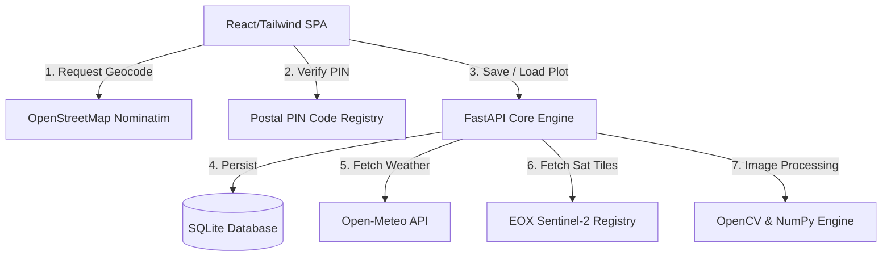

# 🌾 Urban Harvest: Geospatial Sustainable Infrastructure Planner

**Urban Harvest** is an open-source geospatial sustainability and resource planning application. It allows urban developers, property owners, and environmental enthusiasts to evaluate the viability of rooftop real estate for green energy (photovoltaics) and urban agriculture (crops) using computer vision and open mapping data.

Built for the national-level hackathon **Unbound '26** under the theme of **Open Innovation**, this project relies entirely on open-source packages and open APIs to deliver high-fidelity diagnostics without any paid, closed-source dependencies.

---

## 🚀 Key Features

* **Dual-Mode Discovery Engine**:
  - **Global Address Geocoding**: Real-time address matching via OpenStreetMap Nominatim.
  - **Government OGD Postal Registry Verification**: Indian PIN code lookup using public postal records.
* **Geospatial Boundary Lasso**: Trace exact property perimeters directly on high-resolution ESRI world imagery using OpenLayers.
* **Computer Vision Viability Analytics**:
  - Fetches cloudless Sentinel-2 satellite tiles from the open EOX registry matching coordinates.
  - Executes HSV-based color space masks (simulating NDVI) to detect vegetation density.
  - Runs Canny edge detection models (with Gaussian blurs) to calculate structural obstruction indices.
* **Balanced Strategic Recommendations**:
  - **Solar Array Profiles**: Computes recommended plant sizing, exact PV module counts, daily yield expectations, and direct capital amortization (INR investment invoice, 25-year ROI forecasts).
  - **Precision Agri-Matrix**: Computes crop canopy size, expected annual crop yield (kg), and local rainwater collection potential (liters/year).
  - **Co-located Hybrid Arrays**: Evaluates joint agricultural and energy (agrivoltaic) production.
* **Saved Plot Registry Database**: Persists traced coordinates, areas, strategies, and locations to a local relational registry database.

---

## 🛠️ Technical Architecture



### Stack & Components
* **Frontend Engine**:
  * **Framework**: React 18 with Vite
  * **Map Framework**: OpenLayers (`ol`) for high-fidelity GIS interactions
  * **State Container**: Zustand (global mismatch-proof state sync)
  * **Animations & Styles**: Tailwind CSS + Framer Motion + Lucide icons
* **Backend Engine**:
  * **Framework**: FastAPI (Asynchronous Python ASGI)
  * **Computer Vision**: OpenCV (`opencv-python-headless`), NumPy, SciPy
  * **Persistence**: SQLAlchemy ORM with SQLite database (`urban_harvest.db`)

---

## 📥 Getting Started

### Prerequisites
* Python 3.8+
* Node.js 18+
* npm or yarn

---

### Backend Setup

1. Navigate to the backend directory:
   ```bash
   cd backend
   ```
2. Create and activate a virtual environment:
   ```bash
   python3 -m venv env
   source env/bin/activate  # On Windows: env\Scripts\activate
   ```
3. Install required open-source packages:
   ```bash
   pip install -r requirements.txt
   ```
4. Start the FastAPI core server:
   ```bash
   uvicorn main:app --host 0.0.0.0 --port 8000 --reload
   ```
   *Note: On startup, the server automatically initializes `urban_harvest.db` (SQLite database) and creates the required schemas.*

---

### Frontend Setup

1. Navigate to the frontend directory:
   ```bash
   cd ../frontend
   ```
2. Install package dependencies:
   ```bash
   npm install
   ```
3. Boot the Vite development server:
   ```bash
   npm run dev
   ```
4. Open your browser and navigate to the local URL (typically `http://localhost:5173`).

---

## 📂 Project Structure

```text
├── backend/
│   ├── ai_engine/
│   │   └── viability_analyzer.py # CV/NDVI sentinel imagery model
│   ├── database.py               # SQLite tables & database session config
│   ├── main.py                   # FastAPI routing endpoints
│   ├── requirements.txt          # Python packages list
│   └── urban_harvest.db          # Auto-generated SQLite registry database
├── frontend/
│   ├── src/
│   │   ├── components/           # Strategy selectors & tools overlay
│   │   ├── hooks/
│   │   │   └── useMapInit.js     # OpenLayers map and Lasso controller
│   │   ├── pages/
│   │   │   ├── LandingPage.jsx   # Dual-mode address & PIN entry UI
│   │   │   ├── MapWorkspace.jsx  # Map board & side panels
│   │   │   ├── SolarProfileWizard.jsx # Photovoltaic ROI calculators
│   │   │   └── LocationReport.jsx     # General sustainability reports
│   │   ├── store/
│   │   │   └── useReportStore.js      # Global state store
│   │   ├── Dashboard.jsx         # Views routing orchestrator
│   │   ├── main.jsx              # DOM mounting wrapper
│   │   └── index.css             # Tailwinds & OpenLayers imports
│   ├── tailwind.config.js
│   ├── vite.config.js
│   └── package.json
├── LICENSE                       # Open Source MIT License
└── README.md                     # Installation & System Docs
```

---

## 📜 FOSS Compliance & Ecosystem Integration

This project is built under **MIT License** (fully OSI-approved). The core logic relies exclusively on free, open APIs and open-source packages:

1. **Nominatim OpenStreetMap Service**: Provides geocoding without license restrictions.
2. **Open-Meteo Forecast API**: Retrieves live localized macro conditions (temperature, precipitation) without key verification or subscription models.
3. **EOX Sentinel-2 Cloudless Project**: Provides open satellite imagery tiles used to feed local OpenCV visual classifiers.
4. **PostgreSQL / SQLite**: Uses a local relational model that can be easily containerized and scale-deployed.
